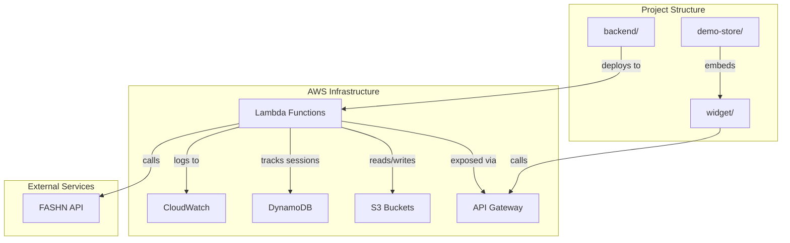
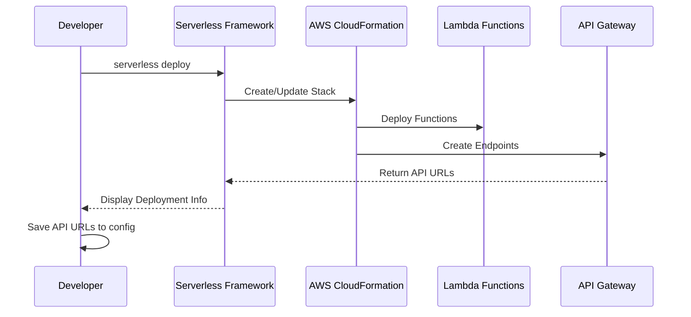

# Design Document: Wishlize Project Setup

## Overview

This design document outlines the technical approach for setting up the Wishlize project structure and initializing the Phase 1 serverless backend infrastructure. The system will establish a production-ready foundation using AWS Lambda, API Gateway, S3, DynamoDB, and the Serverless Framework v3.

The design focuses on:
- Creating a well-organized monorepo structure separating backend, widget, and demo store
- Configuring serverless infrastructure with security best practices
- Establishing monitoring, logging, and error handling from day one
- Providing clear deployment and post-deployment procedures

## Architecture

### High-Level Architecture



### Directory Structure

```
wishlize/
├── backend/
│   ├── serverless.yml          # Serverless Framework configuration
│   ├── handler.js              # Lambda function handlers
│   ├── package.json            # Node.js dependencies
│   ├── .env                    # Environment variables (gitignored)
│   ├── validators/
│   │   └── photoCheck.js       # Photo validation logic (placeholder)
│   └── services/
│       ├── fashnClient.js      # FASHN API client (placeholder)
│       └── s3Service.js        # S3 operations (placeholder)
├── widget/
│   ├── src/
│   │   ├── widget.js           # Widget main logic (placeholder)
│   │   ├── modal.html          # Modal UI template (placeholder)
│   │   ├── styles.css          # Widget styles (placeholder)
│   │   └── config.js           # Widget configuration
│   └── build/                  # Compiled output directory
├── demo-store/
│   ├── index.html              # Store homepage
│   ├── product/
│   │   └── blazer.html         # Sample product page
│   └── assets/
│       ├── images/             # Product images
│       └── css/                # Store stylesheets
├── .gitignore                  # Git ignore rules
├── POST_DEPLOYMENT_TASKS.md    # AWS console tasks documentation
└── README.md                   # Project documentation
```

### Deployment Flow



## Components and Interfaces

### 1. Serverless Framework Configuration (serverless.yml)

**Purpose:** Define infrastructure as code for AWS Lambda deployment

**Configuration Structure:**
```yaml
service: wishlize-backend
frameworkVersion: '3'

provider:
  name: aws
  runtime: nodejs18.x
  region: ap-south-1
  stage: ${opt:stage, 'dev'}
  
  environment:
    FASHN_API_KEY: ${env:FASHN_API_KEY}
    AWS_REGION: ${env:AWS_REGION}
    DYNAMO_TABLE: ${env:DYNAMO_TABLE}
    S3_UPLOAD_BUCKET: wishlize-uploads
    S3_RESULTS_BUCKET: wishlize-results
    S3_CDN_BUCKET: wishlize-cdn
  
  iam:
    role:
      statements:
        - Effect: Allow
          Action:
            - s3:GetObject
            - s3:PutObject
          Resource:
            - arn:aws:s3:::wishlize-uploads/*
            - arn:aws:s3:::wishlize-results/*
            - arn:aws:s3:::wishlize-cdn/*
        - Effect: Allow
          Action:
            - rekognition:DetectFaces
          Resource: '*'
        - Effect: Allow
          Action:
            - dynamodb:GetItem
            - dynamodb:PutItem
            - dynamodb:UpdateItem
            - dynamodb:Query
          Resource:
            - arn:aws:dynamodb:ap-south-1:*:table/WishlizeSessions
  
  logs:
    restApi: true
  
  tracing:
    lambda: true
    apiGateway: true

functions:
  validatePhoto:
    handler: handler.validatePhoto
    memorySize: 512
    timeout: 10
    events:
      - http:
          path: validate-photo
          method: post
          cors: true
  
  processTryOn:
    handler: handler.processTryOn
    memorySize: 1024
    timeout: 30
    events:
      - http:
          path: process-tryon
          method: post
          cors: true

plugins:
  - serverless-offline
  - serverless-dotenv-plugin
```

**Key Design Decisions:**
- Use environment-specific stages (dev, prod) via `${opt:stage, 'dev'}`
- Enable X-Ray tracing for performance monitoring
- Configure different memory/timeout for each function based on expected workload
- Use serverless-dotenv-plugin to load .env variables
- Enable API Gateway logging for request tracking

### 2. Lambda Function Handlers (handler.js)

**Purpose:** Provide initial "Hello World" handlers to verify deployment

**Interface:**
```javascript
// handler.js

const validatePhoto = async (event) => {
  // Input: API Gateway event with photo data
  // Output: HTTP response with validation result
};

const processTryOn = async (event) => {
  // Input: API Gateway event with try-on request
  // Output: HTTP response with processing result
};

module.exports = {
  validatePhoto,
  processTryOn
};
```

**Initial Implementation (Verification Only):**
```javascript
const validatePhoto = async (event) => {
  console.log('validatePhoto invoked', {
    requestId: event.requestContext.requestId,
    timestamp: new Date().toISOString()
  });
  
  return {
    statusCode: 200,
    headers: {
      'Content-Type': 'application/json',
      'Access-Control-Allow-Origin': '*',
      'Access-Control-Allow-Credentials': true
    },
    body: JSON.stringify({
      success: true,
      message: 'validatePhoto endpoint is working',
      requestId: event.requestContext.requestId
    })
  };
};

const processTryOn = async (event) => {
  console.log('processTryOn invoked', {
    requestId: event.requestContext.requestId,
    timestamp: new Date().toISOString()
  });
  
  return {
    statusCode: 200,
    headers: {
      'Content-Type': 'application/json',
      'Access-Control-Allow-Origin': '*',
      'Access-Control-Allow-Credentials': true
    },
    body: JSON.stringify({
      success: true,
      message: 'processTryOn endpoint is working',
      requestId: event.requestContext.requestId
    })
  };
};

module.exports = {
  validatePhoto,
  processTryOn
};
```

**Design Rationale:**
- Include requestId for correlation with CloudWatch logs
- Return consistent response structure for all endpoints
- Include CORS headers in every response
- Log invocation details for monitoring

### 3. Package Configuration (package.json)

**Purpose:** Define Node.js project metadata, dependencies, and scripts

**Structure:**
```json
{
  "name": "wishlize-backend",
  "version": "1.0.0",
  "description": "Wishlize virtual try-on backend API",
  "main": "handler.js",
  "scripts": {
    "deploy": "serverless deploy",
    "deploy:dev": "serverless deploy --stage dev",
    "deploy:prod": "serverless deploy --stage prod",
    "logs": "serverless logs -f validatePhoto --tail",
    "logs:tryon": "serverless logs -f processTryOn --tail",
    "remove": "serverless remove",
    "test": "echo \"Tests not yet implemented\" && exit 0",
    "lint": "eslint ."
  },
  "dependencies": {
    "aws-sdk": "^2.1500.0",
    "axios": "^1.6.0"
  },
  "devDependencies": {
    "serverless": "^3.38.0",
    "serverless-offline": "^13.3.0",
    "serverless-dotenv-plugin": "^6.0.0",
    "eslint": "^8.55.0"
  },
  "engines": {
    "node": ">=18.0.0"
  }
}
```

**Script Descriptions:**
- `deploy`: Deploy to default (dev) stage
- `deploy:dev` / `deploy:prod`: Deploy to specific stages
- `logs` / `logs:tryon`: Tail CloudWatch logs for debugging
- `remove`: Clean up all deployed resources
- `test`: Placeholder for future unit tests
- `lint`: Code quality checks

### 4. Environment Configuration

**Backend Environment Variables (.env):**
```bash
# FASHN API Configuration
FASHN_API_KEY=your_fashn_api_key_here

# AWS Configuration
AWS_REGION=ap-south-1
DYNAMO_TABLE=WishlizeSessions

# S3 Buckets (referenced in serverless.yml)
S3_UPLOAD_BUCKET=wishlize-uploads
S3_RESULTS_BUCKET=wishlize-results
S3_CDN_BUCKET=wishlize-cdn
```

**Widget Configuration (widget/src/config.js):**
```javascript
// Widget configuration constants
// Update API_BASE after deployment with actual API Gateway URL

const CONFIG = {
  // API Gateway base URL (update after deployment)
  API_BASE: 'https://your-api-id.execute-api.ap-south-1.amazonaws.com/dev',
  
  // S3 bucket for photo uploads
  S3_UPLOAD_BUCKET: 'wishlize-uploads',
  
  // Maximum retry attempts for API calls
  MAX_RETRIES: 3,
  
  // Request timeout in milliseconds
  REQUEST_TIMEOUT: 30000,
  
  // Supported image formats
  SUPPORTED_FORMATS: ['image/jpeg', 'image/png', 'image/webp'],
  
  // Maximum file size (10MB)
  MAX_FILE_SIZE: 10 * 1024 * 1024
};

export default CONFIG;
```

### 5. Git Ignore Configuration

**Purpose:** Prevent committing sensitive data and build artifacts

**.gitignore:**
```
# Environment variables
.env
.env.local
.env.*.local

# Dependencies
node_modules/
package-lock.json

# Serverless
.serverless/
.build/

# Logs
*.log
npm-debug.log*

# OS files
.DS_Store
Thumbs.db

# IDE
.vscode/
.idea/
*.swp
*.swo

# Build output
widget/build/
dist/

# AWS credentials (should never be in repo)
.aws/
```

### 6. Placeholder Service Files

**Purpose:** Create file structure for future implementation

**backend/validators/photoCheck.js:**
```javascript
// Photo validation logic
// To be implemented in Phase 2

/**
 * Validates uploaded photo meets requirements
 * @param {Buffer} imageBuffer - Image data
 * @returns {Promise<Object>} Validation result
 */
const validatePhoto = async (imageBuffer) => {
  // TODO: Implement photo validation
  // - Check image format
  // - Verify image dimensions
  // - Use Rekognition to detect faces
  // - Validate face visibility and quality
  
  throw new Error('Not yet implemented');
};

module.exports = {
  validatePhoto
};
```

**backend/services/fashnClient.js:**
```javascript
// FASHN API client
// To be implemented in Phase 2

/**
 * Submits virtual try-on request to FASHN API
 * @param {Object} params - Try-on parameters
 * @returns {Promise<Object>} FASHN API response
 */
const submitTryOnRequest = async (params) => {
  // TODO: Implement FASHN API integration
  // - Authenticate with API key
  // - Submit try-on request
  // - Handle response and errors
  
  throw new Error('Not yet implemented');
};

module.exports = {
  submitTryOnRequest
};
```

**backend/services/s3Service.js:**
```javascript
// S3 operations service
// To be implemented in Phase 2

/**
 * Uploads file to S3 bucket
 * @param {Buffer} fileBuffer - File data
 * @param {string} key - S3 object key
 * @param {string} bucket - S3 bucket name
 * @returns {Promise<string>} S3 object URL
 */
const uploadFile = async (fileBuffer, key, bucket) => {
  // TODO: Implement S3 upload
  // - Upload file to specified bucket
  // - Set appropriate permissions
  // - Return object URL
  
  throw new Error('Not yet implemented');
};

/**
 * Generates presigned URL for S3 object
 * @param {string} key - S3 object key
 * @param {string} bucket - S3 bucket name
 * @returns {Promise<string>} Presigned URL
 */
const getPresignedUrl = async (key, bucket) => {
  // TODO: Implement presigned URL generation
  
  throw new Error('Not yet implemented');
};

module.exports = {
  uploadFile,
  getPresignedUrl
};
```

### 7. Demo Store Pages

**demo-store/index.html:**
```html
<!DOCTYPE html>
<html lang="en">
<head>
    <meta charset="UTF-8">
    <meta name="viewport" content="width=device-width, initial-scale=1.0">
    <title>Wishlize Demo Store</title>
    <link rel="stylesheet" href="assets/css/store.css">
</head>
<body>
    <header>
        <h1>Wishlize Demo Store</h1>
        <p>Virtual Try-On Technology Demo</p>
    </header>
    
    <main>
        <section class="products">
            <h2>Featured Products</h2>
            <div class="product-grid">
                <div class="product-card">
                    
                    <h3>Classic Navy Blazer</h3>
                    <p>$299.99</p>
                    <a href="product/blazer.html" class="btn">View Product</a>
                </div>
                <!-- More products can be added here -->
            </div>
        </section>
    </main>
    
    <footer>
        <p>&copy; 2026 Wishlize Demo Store</p>
    </footer>
</body>
</html>
```

**demo-store/product/blazer.html:**
```html
<!DOCTYPE html>
<html lang="en">
<head>
    <meta charset="UTF-8">
    <meta name="viewport" content="width=device-width, initial-scale=1.0">
    <title>Classic Navy Blazer - Wishlize Demo Store</title>
    <link rel="stylesheet" href="../assets/css/store.css">
</head>
<body>
    <header>
        <h1>Wishlize Demo Store</h1>
        <nav>
            <a href="../index.html">← Back to Store</a>
        </nav>
    </header>
    
    <main>
        <section class="product-detail">
            <div class="product-images">
                
            </div>
            
            <div class="product-info">
                <h2>Classic Navy Blazer</h2>
                <p class="price">$299.99</p>
                <p class="description">
                    A timeless navy blazer perfect for any occasion. 
                    Premium fabric with modern fit.
                </p>
                
                <!-- Wishlize widget will be integrated here -->
                <div id="wishlize-widget-container">
                    <p><em>Wishlize Virtual Try-On widget will be integrated here</em></p>
                </div>
                
                <button class="btn btn-primary">Add to Cart</button>
            </div>
        </section>
    </main>
    
    <footer>
        <p>&copy; 2026 Wishlize Demo Store</p>
    </footer>
    
    <!-- Widget script will be loaded here -->
    <!-- <script src="../widget/build/wishlize-widget.js"></script> -->
</body>
</html>
```

**demo-store/assets/css/store.css:**
```css
/* Basic demo store styles */
* {
    margin: 0;
    padding: 0;
    box-sizing: border-box;
}

body {
    font-family: -apple-system, BlinkMacSystemFont, 'Segoe UI', Roboto, Oxygen, Ubuntu, Cantarell, sans-serif;
    line-height: 1.6;
    color: #333;
}

header {
    background: #2c3e50;
    color: white;
    padding: 2rem;
    text-align: center;
}

main {
    max-width: 1200px;
    margin: 2rem auto;
    padding: 0 1rem;
}

.product-grid {
    display: grid;
    grid-template-columns: repeat(auto-fill, minmax(250px, 1fr));
    gap: 2rem;
    margin-top: 2rem;
}

.product-card {
    border: 1px solid #ddd;
    border-radius: 8px;
    padding: 1rem;
    text-align: center;
}

.product-card img {
    width: 100%;
    height: 300px;
    object-fit: cover;
    border-radius: 4px;
}

.btn {
    display: inline-block;
    padding: 0.75rem 1.5rem;
    background: #3498db;
    color: white;
    text-decoration: none;
    border-radius: 4px;
    margin-top: 1rem;
    border: none;
    cursor: pointer;
}

.btn:hover {
    background: #2980b9;
}

.btn-primary {
    background: #27ae60;
}

.btn-primary:hover {
    background: #229954;
}

.product-detail {
    display: grid;
    grid-template-columns: 1fr 1fr;
    gap: 3rem;
    margin-top: 2rem;
}

.product-images img {
    width: 100%;
    border-radius: 8px;
}

.product-info h2 {
    font-size: 2rem;
    margin-bottom: 1rem;
}

.price {
    font-size: 1.5rem;
    color: #27ae60;
    font-weight: bold;
    margin-bottom: 1rem;
}

#wishlize-widget-container {
    background: #f8f9fa;
    border: 2px dashed #ddd;
    padding: 2rem;
    margin: 2rem 0;
    border-radius: 8px;
    text-align: center;
}

footer {
    background: #2c3e50;
    color: white;
    text-align: center;
    padding: 2rem;
    margin-top: 4rem;
}

@media (max-width: 768px) {
    .product-detail {
        grid-template-columns: 1fr;
    }
}
```

### 8. Post-Deployment Tasks Documentation

**POST_DEPLOYMENT_TASKS.md:**
```markdown
# Post-Deployment Tasks for Wishlize Backend

After running `npm run deploy`, complete these tasks in the AWS Console to finalize the setup.

## 1. Verify S3 Bucket CORS Configuration

**Location:** S3 Console → Buckets → wishlize-uploads → Permissions → CORS

**Required CORS Configuration:**
\`\`\`json
[
    {
        "AllowedHeaders": ["*"],
        "AllowedMethods": ["GET", "PUT", "POST"],
        "AllowedOrigins": ["*"],
        "ExposeHeaders": ["ETag"],
        "MaxAgeSeconds": 3000
    }
]
\`\`\`

**Action:** Verify this configuration exists for all three buckets:
- wishlize-uploads
- wishlize-results
- wishlize-cdn

## 2. Verify DynamoDB Table Configuration

**Location:** DynamoDB Console → Tables → WishlizeSessions

**Verify:**
- ✅ Partition key: `email` (String)
- ✅ Sort key: `sessionId` (String)
- ✅ On-demand billing mode (or provisioned with appropriate capacity)
- ✅ Point-in-time recovery enabled (recommended for production)

## 3. Configure CloudWatch Alarms

**Location:** CloudWatch Console → Alarms → Create Alarm

**Create the following alarms:**

### Alarm 1: Lambda Error Rate
- **Metric:** Lambda → Errors (validatePhoto + processTryOn)
- **Threshold:** > 5% error rate
- **Period:** 5 minutes
- **Action:** Send SNS notification to your email

### Alarm 2: Lambda Duration
- **Metric:** Lambda → Duration (processTryOn)
- **Threshold:** > 25000 ms (25 seconds)
- **Period:** 5 minutes
- **Action:** Send SNS notification to your email

### Alarm 3: API Gateway 5xx Errors
- **Metric:** API Gateway → 5XXError
- **Threshold:** > 10 errors
- **Period:** 5 minutes
- **Action:** Send SNS notification to your email

## 4. Test Deployed Endpoints

**Get API Gateway URL from deployment output:**
\`\`\`bash
# The URL will be displayed after deployment, format:
# https://{api-id}.execute-api.ap-south-1.amazonaws.com/dev
\`\`\`

**Test validatePhoto endpoint:**
\`\`\`bash
curl -X POST https://YOUR_API_ID.execute-api.ap-south-1.amazonaws.com/dev/validate-photo \\
  -H "Content-Type: application/json" \\
  -d '{}'
\`\`\`

**Expected Response:**
\`\`\`json
{
  "success": true,
  "message": "validatePhoto endpoint is working",
  "requestId": "..."
}
\`\`\`

**Test processTryOn endpoint:**
\`\`\`bash
curl -X POST https://YOUR_API_ID.execute-api.ap-south-1.amazonaws.com/dev/process-tryon \\
  -H "Content-Type: application/json" \\
  -d '{}'
\`\`\`

**Expected Response:**
\`\`\`json
{
  "success": true,
  "message": "processTryOn endpoint is working",
  "requestId": "..."
}
\`\`\`

## 5. Update Widget Configuration

**File:** `widget/src/config.js`

**Action:** Replace the placeholder API_BASE URL with your actual API Gateway URL:
\`\`\`javascript
const CONFIG = {
  API_BASE: 'https://YOUR_ACTUAL_API_ID.execute-api.ap-south-1.amazonaws.com/dev',
  // ... rest of config
};
\`\`\`

## 6. Verify IAM Role Permissions

**Location:** IAM Console → Roles → Search for "wishlize-backend"

**Verify the Lambda execution role has policies for:**
- ✅ S3 read/write access to wishlize-* buckets
- ✅ DynamoDB read/write access to WishlizeSessions table
- ✅ Rekognition DetectFaces permission
- ✅ CloudWatch Logs write permission
- ✅ X-Ray write permission

## 7. Configure API Gateway Custom Domain (Optional)

**Location:** API Gateway Console → Custom Domain Names

**If you want a custom domain (e.g., api.wishlize.ai):**
1. Request/import SSL certificate in ACM (Certificate Manager)
2. Create custom domain name in API Gateway
3. Map domain to your API
4. Update Route 53 DNS records

## 8. Enable API Gateway Request Validation (Recommended)

**Location:** API Gateway Console → Your API → Models & Request Validators

**Action:** Create request validators for:
- Body validation
- Query string validation
- Headers validation

This will reject malformed requests before they reach Lambda, saving costs.

## 9. Review CloudWatch Logs

**Location:** CloudWatch Console → Log Groups

**Verify log groups exist:**
- `/aws/lambda/wishlize-backend-dev-validatePhoto`
- `/aws/lambda/wishlize-backend-dev-processTryOn`

**Check that logs are being written:**
- Invoke the endpoints via curl
- Refresh the log streams
- Verify you see invocation logs with requestId

## 10. Save Deployment Information

**Create a file:** `deployment-info.txt`

**Save the following information:**
\`\`\`
Deployment Date: [DATE]
Stage: dev
Region: ap-south-1
API Gateway URL: [YOUR_URL]
Lambda Functions:
  - wishlize-backend-dev-validatePhoto
  - wishlize-backend-dev-processTryOn
S3 Buckets:
  - wishlize-uploads
  - wishlize-results
  - wishlize-cdn
DynamoDB Table: WishlizeSessions
\`\`\`

## Checklist

- [ ] S3 CORS configuration verified
- [ ] DynamoDB table configuration verified
- [ ] CloudWatch alarms created
- [ ] Endpoints tested successfully
- [ ] Widget config.js updated with API URL
- [ ] IAM permissions verified
- [ ] CloudWatch logs verified
- [ ] Deployment info saved
- [ ] (Optional) Custom domain configured
- [ ] (Optional) API Gateway request validation enabled

## Next Steps

Once all tasks are complete, you're ready to proceed with Phase 2:
- Implement photo validation logic (Day 2)
- Integrate FASHN API (Day 3-4)
- Build widget UI (Day 5-6)
\`\`\`
```

## Data Models

### DynamoDB Session Schema

**Table:** WishlizeSessions

**Keys:**
- Partition Key: `email` (String)
- Sort Key: `sessionId` (String)

**Attributes:**
```javascript
{
  email: String,              // User email (partition key)
  sessionId: String,          // Unique session ID (sort key)
  createdAt: Number,          // Unix timestamp
  updatedAt: Number,          // Unix timestamp
  status: String,             // 'pending' | 'processing' | 'completed' | 'failed'
  photoUrl: String,           // S3 URL of uploaded photo
  garmentUrl: String,         // S3 URL of garment image
  resultUrl: String,          // S3 URL of try-on result (when completed)
  fashnJobId: String,         // FASHN API job ID
  metadata: Object            // Additional session data
}
```

**Access Patterns:**
1. Get session by email and sessionId: `GetItem(email, sessionId)`
2. Query all sessions for a user: `Query(email)`
3. Update session status: `UpdateItem(email, sessionId, {status, resultUrl})`

### API Request/Response Models

**validatePhoto Request:**
```javascript
{
  email: String,              // User email
  imageData: String,          // Base64 encoded image or S3 key
  sessionId: String           // Optional: existing session ID
}
```

**validatePhoto Response:**
```javascript
{
  success: Boolean,
  sessionId: String,          // Created or existing session ID
  message: String,
  validation: {
    isValid: Boolean,
    faceDetected: Boolean,
    quality: String,          // 'good' | 'acceptable' | 'poor'
    issues: Array<String>     // List of validation issues
  }
}
```

**processTryOn Request:**
```javascript
{
  email: String,
  sessionId: String,
  garmentUrl: String          // URL of garment to try on
}
```

**processTryOn Response:**
```javascript
{
  success: Boolean,
  sessionId: String,
  status: String,             // 'processing' | 'completed' | 'failed'
  resultUrl: String,          // S3 URL when completed
  estimatedTime: Number,      // Seconds until completion
  message: String
}
```


## Correctness Properties

A property is a characteristic or behavior that should hold true across all valid executions of a system—essentially, a formal statement about what the system should do. Properties serve as the bridge between human-readable specifications and machine-verifiable correctness guarantees.

For the Wishlize project setup, correctness properties focus on validating that the generated project structure, configuration files, and code artifacts meet all specified requirements. These properties can be verified through automated tests that parse and validate the created files.

### Property 1: Complete Project Structure

*For any* project setup execution, all required directories and files SHALL exist at their specified paths, including:
- backend/ with serverless.yml, handler.js, package.json
- backend/validators/ and backend/services/ directories
- widget/src/ with widget.js, modal.html, styles.css, config.js
- widget/build/ directory
- demo-store/ with index.html, product/blazer.html
- demo-store/assets/images/ and demo-store/assets/css/ directories
- POST_DEPLOYMENT_TASKS.md file
- .gitignore file

**Validates: Requirements 1.1, 1.2, 1.3, 1.4, 1.5, 1.6, 1.7, 9.1, 10.1, 10.2, 10.3, 10.4, 13.1**

### Property 2: Package.json Completeness

*For any* generated package.json file, it SHALL contain:
- name field set to "wishlize-backend"
- engines.node specifying ">=18.0.0"
- aws-sdk in dependencies
- axios in dependencies
- All required scripts: deploy, deploy:dev, deploy:prod, logs, remove, test, lint

**Validates: Requirements 2.1, 2.2, 2.3, 2.4, 2.5, 14.1, 14.2, 14.3, 14.4, 14.5, 14.6, 14.7**

### Property 3: Serverless Provider Configuration

*For any* generated serverless.yml file, the provider section SHALL specify:
- name: aws
- runtime: nodejs18.x
- region: ap-south-1
- logs.restApi: true
- tracing.lambda: true
- tracing.apiGateway: true

**Validates: Requirements 3.2, 3.3, 3.4, 11.4, 11.9**

### Property 4: Lambda Function Definitions

*For any* generated serverless.yml file, it SHALL define both validatePhoto and processTryOn functions where:
- Each function has an HTTP POST endpoint
- Each function's HTTP event has cors: true
- processTryOn has timeout: 30
- processTryOn has memorySize >= 512
- validatePhoto has memorySize >= 512

**Validates: Requirements 3.5, 3.6, 3.7, 3.8, 11.10**

### Property 5: IAM Least-Privilege Permissions

*For any* generated serverless.yml file, the IAM role statements SHALL:
- Grant s3:GetObject and s3:PutObject only to wishlize-* bucket ARNs (not all S3 buckets)
- Grant rekognition:DetectFaces with Resource: '*' (service-level permission)
- Grant dynamodb:GetItem, PutItem, UpdateItem, Query only to WishlizeSessions table ARN
- NOT use wildcard (*) for S3 or DynamoDB resources

**Validates: Requirements 5.1, 5.2, 5.3, 5.4, 5.5, 11.3**

### Property 6: Environment Variable Configuration

*For any* generated serverless.yml file, the provider.environment section SHALL reference:
- FASHN_API_KEY via ${env:FASHN_API_KEY}
- AWS_REGION via ${env:AWS_REGION}
- DYNAMO_TABLE via ${env:DYNAMO_TABLE}
- S3_UPLOAD_BUCKET, S3_RESULTS_BUCKET, S3_CDN_BUCKET as direct values

**Validates: Requirements 6.2, 8.1, 8.5**

### Property 7: Lambda Handler Response Structure

*For any* Lambda handler function (validatePhoto, processTryOn), when invoked with a mock event, the response SHALL:
- Have statusCode: 200
- Have headers including 'Access-Control-Allow-Origin': '*'
- Have headers including 'Content-Type': 'application/json'
- Have a body that is valid JSON
- Have a parsed body containing success: true
- Have a parsed body containing a requestId field

**Validates: Requirements 4.2, 4.3, 4.4, 4.5**

### Property 8: Lambda Handler Logging

*For any* Lambda handler function, when invoked with a mock event, it SHALL log to console with:
- The requestId from event.requestContext.requestId
- A timestamp in ISO format
- The function name or identifier

**Validates: Requirements 12.5, 12.6**

### Property 9: Widget Configuration Constants

*For any* generated widget/src/config.js file, the exported CONFIG object SHALL contain:
- API_BASE property (string)
- S3_UPLOAD_BUCKET property with value "wishlize-uploads"
- MAX_RETRIES property with value 3
- REQUEST_TIMEOUT property (number)
- SUPPORTED_FORMATS property (array)
- MAX_FILE_SIZE property (number)

**Validates: Requirements 9.2, 9.3, 9.4**

### Property 10: Backend Environment File Structure

*For any* generated backend/.env file, it SHALL contain variable declarations for:
- FASHN_API_KEY
- AWS_REGION
- DYNAMO_TABLE

**Validates: Requirements 6.1**

### Property 11: Git Ignore Security

*For any* generated .gitignore file, it SHALL include patterns to exclude:
- .env (and .env.* variants)
- node_modules/
- .serverless/
- .aws/

**Validates: Requirements 6.4**

### Property 12: Post-Deployment Documentation Completeness

*For any* generated POST_DEPLOYMENT_TASKS.md file, it SHALL include sections or content mentioning:
- S3 CORS configuration
- DynamoDB table verification
- CloudWatch alarms
- API Gateway custom domain
- Endpoint testing with curl
- IAM role permissions verification

**Validates: Requirements 13.2, 13.3, 13.4, 13.5, 13.6, 13.7**

### Property 13: Demo Store Widget Integration Placeholder

*For any* generated demo-store HTML file (index.html, product/blazer.html), it SHALL contain:
- An element or comment indicating where the Wishlize widget will be integrated
- Either an element with id containing "wishlize" or a comment mentioning "Wishlize" or "widget"

**Validates: Requirements 10.5**

### Property 14: CORS Enabled for All Endpoints

*For all* HTTP event configurations in serverless.yml functions, the cors property SHALL be set to true.

**Validates: Requirements 3.8**

## Error Handling

### Setup Phase Errors

**Missing Dependencies:**
- If Node.js version < 18.x: Display error message and exit
- If npm is not installed: Display error message with installation instructions
- If Serverless Framework is not installed: Provide installation command

**File System Errors:**
- If directories cannot be created due to permissions: Display clear error with required permissions
- If files already exist: Prompt user to confirm overwrite or skip
- If disk space is insufficient: Display error with space requirements

**Configuration Errors:**
- If .env file is missing required variables: List missing variables in error message
- If serverless.yml has syntax errors: Display YAML parsing error with line number
- If package.json has invalid JSON: Display JSON parsing error

### Deployment Phase Errors

**AWS Credential Errors:**
- If AWS credentials are not configured: Provide instructions for `aws configure`
- If credentials lack required permissions: List required IAM permissions
- If region is not accessible: Suggest checking AWS service availability

**Deployment Failures:**
- If CloudFormation stack creation fails: Display CloudFormation error message
- If Lambda deployment fails: Check function size, timeout, and memory settings
- If API Gateway creation fails: Verify account limits and quotas

**Resource Conflicts:**
- If S3 bucket names are taken: Suggest alternative bucket names
- If DynamoDB table doesn't exist: Provide table creation instructions
- If IAM role name conflicts: Suggest using unique role names

### Runtime Errors (Initial Handlers)

**Lambda Invocation Errors:**
- If event object is malformed: Log error and return 400 Bad Request
- If internal error occurs: Log full error stack and return 500 Internal Server Error
- If timeout is approaching: Log warning before timeout occurs

**Logging Errors:**
- If CloudWatch Logs are not accessible: Fall back to console.error
- If log group doesn't exist: AWS Lambda creates it automatically
- If log retention fails: Document in POST_DEPLOYMENT_TASKS.md

## Testing Strategy

### Dual Testing Approach

The Wishlize project setup will use both unit tests and property-based tests to ensure comprehensive validation:

**Unit Tests:**
- Verify specific file contents match expected templates
- Test individual configuration parsing functions
- Validate specific edge cases (e.g., empty directories, malformed JSON)
- Test error handling for specific failure scenarios

**Property-Based Tests:**
- Validate universal properties across all generated artifacts
- Test that all required files and directories exist
- Verify configuration files parse correctly and contain required fields
- Ensure all Lambda handlers return valid responses

### Property-Based Testing Configuration

**Testing Library:** fast-check (for JavaScript/Node.js)

**Test Configuration:**
- Minimum 100 iterations per property test
- Each test tagged with feature name and property number
- Tag format: `Feature: wishlize-project-setup, Property {N}: {property description}`

**Example Property Test Structure:**
```javascript
const fc = require('fast-check');
const fs = require('fs');
const path = require('path');
const yaml = require('js-yaml');

describe('Feature: wishlize-project-setup, Property 3: Serverless Provider Configuration', () => {
  it('should have correct provider configuration in serverless.yml', () => {
    const serverlessPath = path.join(__dirname, '../backend/serverless.yml');
    const content = fs.readFileSync(serverlessPath, 'utf8');
    const config = yaml.load(content);
    
    expect(config.provider.name).toBe('aws');
    expect(config.provider.runtime).toBe('nodejs18.x');
    expect(config.provider.region).toBe('ap-south-1');
    expect(config.provider.logs.restApi).toBe(true);
    expect(config.provider.tracing.lambda).toBe(true);
    expect(config.provider.tracing.apiGateway).toBe(true);
  });
});
```

### Unit Test Focus Areas

**Configuration File Validation:**
- Test package.json has all required scripts
- Test serverless.yml parses without errors
- Test .env file format is correct
- Test widget config.js exports valid configuration

**File Structure Validation:**
- Test all required directories exist
- Test all required files exist
- Test file permissions are correct
- Test .gitignore excludes sensitive files

**Handler Function Validation:**
- Test validatePhoto returns 200 status
- Test processTryOn returns 200 status
- Test CORS headers are present
- Test response body is valid JSON

**Edge Cases:**
- Test behavior when files already exist
- Test behavior with insufficient permissions
- Test behavior with invalid configuration values
- Test behavior with missing dependencies

### Integration Testing (Post-Deployment)

**Deployment Verification:**
- Deploy to AWS dev environment
- Verify Lambda functions are created
- Verify API Gateway endpoints are accessible
- Verify CloudWatch log groups are created

**Endpoint Testing:**
- Send POST request to validatePhoto endpoint
- Send POST request to processTryOn endpoint
- Verify responses have correct structure
- Verify CORS headers are present

**AWS Resource Verification:**
- Verify IAM role has correct permissions
- Verify Lambda functions have correct configuration
- Verify environment variables are set correctly
- Verify X-Ray tracing is enabled

### Test Execution Commands

```bash
# Run all tests
npm test

# Run unit tests only
npm run test:unit

# Run property tests only
npm run test:property

# Run tests with coverage
npm run test:coverage

# Run integration tests (requires AWS credentials)
npm run test:integration
```

### Continuous Integration

**Pre-commit Hooks:**
- Run linter on all JavaScript files
- Run unit tests
- Validate configuration file syntax

**CI Pipeline (GitHub Actions / GitLab CI):**
1. Install dependencies
2. Run linter
3. Run unit tests
4. Run property-based tests
5. Generate coverage report
6. (Optional) Deploy to dev environment
7. (Optional) Run integration tests

### Test Coverage Goals

- Configuration file validation: 100%
- Handler functions: 100%
- Error handling: 80%
- Overall code coverage: 90%
